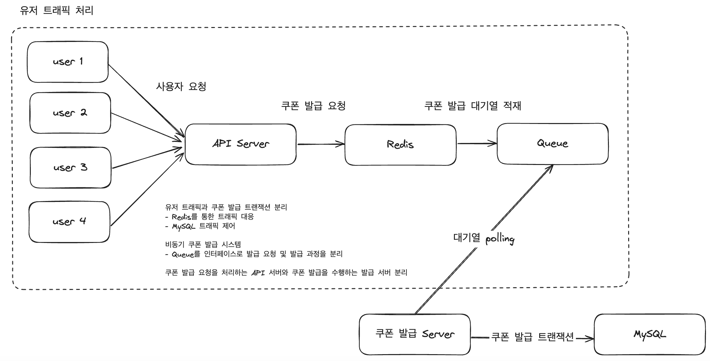
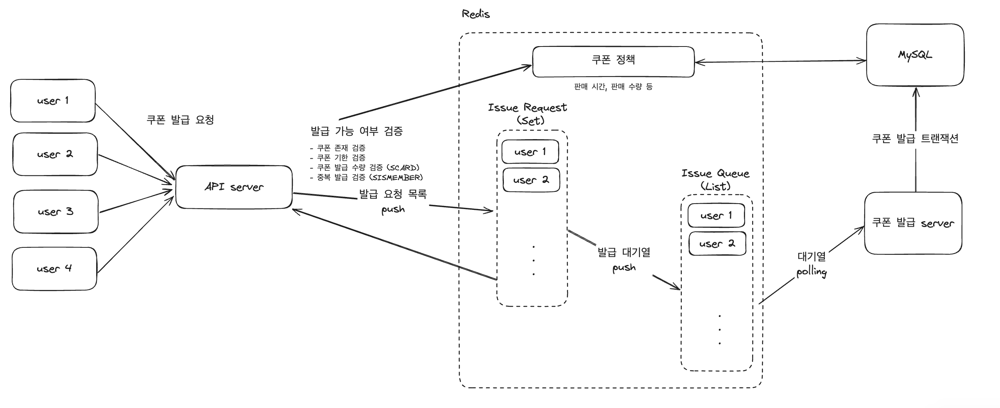

# 개요
이 프로젝트는 선착순 쿠폰 시스템을 간소화한 버전입니다.

# 요구사항
- 이벤트 기간 내에만 발급이 가능
- 유저당 1번만 쿠폰 발급이 가능
- 최대 쿠폰 발급 수량이 존재

## 쿠폰 발급 검증
- 발급 기한
- 발급 수량
- 중복 발급

## 쿠폰 발급 수량 관리
- Redis Set 기반 재고 관리

## 비동기 쿠폰 발급
- 쿠폰 발급 서버에서 Queue Polling Scheduler
- Redis List로 발급 큐 구현

# 기술 스택
### Infra
AWS EC2, AWS RDS, AWS Elastic Cache

### Server
Java 17, Spring Boot 3.1.5, Spring MVC, JPA, QueryDsl

### Database
MySQL 8, H2, Redis 7

### Monitoring
AWS Cloud Watch, Spring Actuator, Prometheus, Grafana

### Etc
Locust, Gradle, Docker

# 전체 구조

